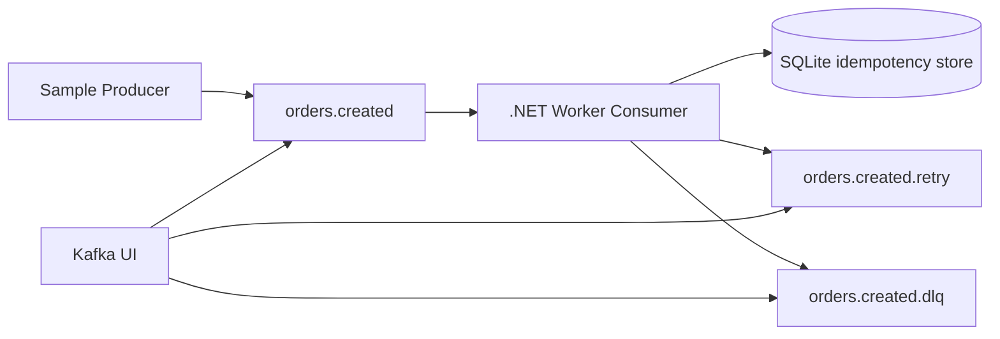

# dotnet-kafka-consumer-lab - Codex-Ready PLAN.md

## 1. Goal

Create a small but production-minded .NET sample repository that demonstrates a reliable Apache Kafka consumer using modern .NET worker patterns.

The repository must be easy to run locally, easy to understand, and useful as a reference for real services that consume Kafka messages safely.

Repository name:

```text
dotnet-kafka-consumer-lab
```

Primary learning objective:

```text
Show how to build a Kafka consumer that processes messages safely, commits offsets only after durable success, retries transient failures, sends poison messages to a DLQ, supports idempotency, and shuts down cleanly.
```

## 2. Non-goals

This project is not intended to be a full enterprise event platform.

Do not implement:

- Kafka Streams.
- Exactly-once distributed transactions.
- Kubernetes manifests.
- Complex schema evolution workflows.
- Multi-tenant authorization.
- Cloud-specific Kafka configuration.
- A web UI, except optional Kafka UI through Docker Compose.

## 3. Technology choices

Use:

- .NET 10 if installed locally, otherwise .NET 8 LTS is acceptable.
- C#.
- Confluent.Kafka for Kafka producer and consumer access.
- Microsoft.Extensions.Hosting for worker lifetime.
- Microsoft.Extensions.Options for configuration binding and validation.
- Microsoft.Extensions.Logging for structured logs.
- System.Text.Json for initial JSON serialization.
- SQLite for local idempotency storage.
- Docker Compose for Kafka, Kafka UI, and optional topic initialization.

Optional later extension:

- Confluent Schema Registry.
- JSON Schema, Avro, or Protobuf serialization.
- OpenTelemetry metrics and traces.

## 4. Design principles

The sample must demonstrate these principles:

1. Process before commit.
2. Disable automatic offset commit.
3. Treat duplicates as expected, not exceptional.
4. Commit the source offset only after one of these durable outcomes:
   - message was processed successfully;
   - message was recognized as duplicate and skipped safely;
   - message was written to retry topic successfully;
   - message was written to DLQ successfully.
5. Never drop a failed message silently.
6. Separate Kafka plumbing from domain processing.
7. Keep failure behavior explicit and testable.
8. Make local execution one-command friendly.

## 5. Repository layout

Create this structure:

```text
dotnet-kafka-consumer-lab/
  README.md
  PLAN.md
  .gitignore
  .editorconfig
  Directory.Build.props
  DotNetKafkaConsumerLab.slnx
  docker/
    docker-compose.yml
    kafka-init.sh
  docs/
    DESIGN.md
    FAILURE_MODES.md
    OPERATIONS.md
  src/
    KafkaConsumerLab.Contracts/
      KafkaConsumerLab.Contracts.csproj
      OrderCreated.cs
      ProcessingResult.cs
    KafkaConsumerLab.Worker/
      KafkaConsumerLab.Worker.csproj
      Program.cs
      appsettings.json
      appsettings.Development.json
      Configuration/
        KafkaOptions.cs
        ConsumerOptions.cs
        RetryOptions.cs
        DlqOptions.cs
        IdempotencyOptions.cs
      Kafka/
        KafkaConsumerHostedService.cs
        KafkaConsumerRunner.cs
        KafkaConsumerFactory.cs
        KafkaProducerFactory.cs
        TopicNames.cs
        KafkaHeaders.cs
        KafkaMessageSerializer.cs
        ConsumedMessage.cs
        CommitDecision.cs
        ConsumerRebalanceHandlers.cs
      Processing/
        IOrderMessageProcessor.cs
        OrderMessageProcessor.cs
        ProcessingException.cs
        TransientProcessingException.cs
        PoisonMessageException.cs
      Reliability/
        RetryPublisher.cs
        DlqPublisher.cs
        ProcessingAttemptClassifier.cs
        BackoffCalculator.cs
      Idempotency/
        IProcessedMessageStore.cs
        SqliteProcessedMessageStore.cs
        ProcessedMessageRecord.cs
      Diagnostics/
        ConsumerMetrics.cs
        LogEvents.cs
    KafkaConsumerLab.Producer/
      KafkaConsumerLab.Producer.csproj
      Program.cs
      ProducerOptions.cs
      SampleMessageFactory.cs
  tests/
    KafkaConsumerLab.Tests/
      KafkaConsumerLab.Tests.csproj
      BackoffCalculatorTests.cs
      ProcessingAttemptClassifierTests.cs
      KafkaHeaderTests.cs
      IdempotencyKeyTests.cs
```

## 6. Solution and project setup

Create a solution file:

```bash
dotnet new sln --name DotNetKafkaConsumerLab --format slnx
```

Create projects:

```bash
dotnet new classlib -n KafkaConsumerLab.Contracts -o src/KafkaConsumerLab.Contracts
dotnet new worker -n KafkaConsumerLab.Worker -o src/KafkaConsumerLab.Worker
dotnet new console -n KafkaConsumerLab.Producer -o src/KafkaConsumerLab.Producer
dotnet new xunit -n KafkaConsumerLab.Tests -o tests/KafkaConsumerLab.Tests
```

Add projects to solution:

```bash
dotnet sln DotNetKafkaConsumerLab.slnx add src/KafkaConsumerLab.Contracts/KafkaConsumerLab.Contracts.csproj
dotnet sln DotNetKafkaConsumerLab.slnx add src/KafkaConsumerLab.Worker/KafkaConsumerLab.Worker.csproj
dotnet sln DotNetKafkaConsumerLab.slnx add src/KafkaConsumerLab.Producer/KafkaConsumerLab.Producer.csproj
dotnet sln DotNetKafkaConsumerLab.slnx add tests/KafkaConsumerLab.Tests/KafkaConsumerLab.Tests.csproj
```

Project references:

```bash
dotnet add src/KafkaConsumerLab.Worker/KafkaConsumerLab.Worker.csproj reference src/KafkaConsumerLab.Contracts/KafkaConsumerLab.Contracts.csproj
dotnet add src/KafkaConsumerLab.Producer/KafkaConsumerLab.Producer.csproj reference src/KafkaConsumerLab.Contracts/KafkaConsumerLab.Contracts.csproj
dotnet add tests/KafkaConsumerLab.Tests/KafkaConsumerLab.Tests.csproj reference src/KafkaConsumerLab.Worker/KafkaConsumerLab.Worker.csproj
```

NuGet packages:

```bash
dotnet add src/KafkaConsumerLab.Worker/KafkaConsumerLab.Worker.csproj package Confluent.Kafka
dotnet add src/KafkaConsumerLab.Worker/KafkaConsumerLab.Worker.csproj package Microsoft.Data.Sqlite
dotnet add src/KafkaConsumerLab.Worker/KafkaConsumerLab.Worker.csproj package Microsoft.Extensions.Options.DataAnnotations

dotnet add src/KafkaConsumerLab.Producer/KafkaConsumerLab.Producer.csproj package Confluent.Kafka

dotnet add tests/KafkaConsumerLab.Tests/KafkaConsumerLab.Tests.csproj package FluentAssertions
```

## 7. Directory.Build.props

Create `Directory.Build.props`:

```xml
<Project>
  <PropertyGroup>
    <TargetFramework>net10.0</TargetFramework>
    <Nullable>enable</Nullable>
    <ImplicitUsings>enable</ImplicitUsings>
    <TreatWarningsAsErrors>true</TreatWarningsAsErrors>
    <AnalysisLevel>latest</AnalysisLevel>
    <LangVersion>latest</LangVersion>
  </PropertyGroup>
</Project>
```

If the developer does not have .NET 10, change `TargetFramework` to `net8.0` consistently across the repository.

## 8. Kafka topics

Use these topics:

```text
orders.created
orders.created.retry
orders.created.dlq
```

Topic behavior:

- `orders.created` is the main input topic.
- `orders.created.retry` receives messages that failed because of transient errors.
- `orders.created.dlq` receives poison or permanently failed messages.

For the first version, the worker consumes only `orders.created`.

A later extension may add a second worker that consumes `orders.created.retry` and replays messages back into `orders.created` after a delay. Kafka itself does not provide native delayed delivery, so the initial retry topic is a parking topic rather than a scheduler.

## 9. Docker Compose

Create `docker/docker-compose.yml`.

Use a simple single-broker local Kafka setup in KRaft mode if the selected image supports it cleanly, or use a stable image that includes Zookeeper if that is simpler.

Recommended services:

- kafka
- kafka-ui
- kafka-init

Kafka UI should expose:

```text
http://localhost:8080
```

Kafka should expose:

```text
localhost:9092
```

The `kafka-init` service must create these topics idempotently:

```bash
kafka-topics --bootstrap-server kafka:9092 --create --if-not-exists --topic orders.created --partitions 6 --replication-factor 1
kafka-topics --bootstrap-server kafka:9092 --create --if-not-exists --topic orders.created.retry --partitions 6 --replication-factor 1
kafka-topics --bootstrap-server kafka:9092 --create --if-not-exists --topic orders.created.dlq --partitions 6 --replication-factor 1
```

Acceptance command:

```bash
docker compose -f docker/docker-compose.yml up -d
```

Then Kafka UI must be reachable at:

```text
http://localhost:8080
```

## 10. Message contract

Create `OrderCreated`:

```csharp
namespace KafkaConsumerLab.Contracts;

public sealed record OrderCreated(
    string EventId,
    string OrderId,
    string CustomerId,
    decimal Amount,
    string Currency,
    DateTimeOffset CreatedAtUtc,
    string? FailureMode);
```

`FailureMode` is for demo/testing only.

Supported values:

```text
null or empty => process successfully
transient => throw TransientProcessingException
poison => throw PoisonMessageException
unexpected => throw InvalidOperationException
slow => simulate slow processing
```

Create `ProcessingResult`:

```csharp
namespace KafkaConsumerLab.Contracts;

public enum ProcessingResult
{
    Processed = 0,
    Duplicate = 1,
    Retried = 2,
    DeadLettered = 3
}
```

## 11. Producer CLI

The producer CLI must support simple commands:

```bash
dotnet run --project src/KafkaConsumerLab.Producer -- valid --count 10
dotnet run --project src/KafkaConsumerLab.Producer -- transient --count 3
dotnet run --project src/KafkaConsumerLab.Producer -- poison --count 3
dotnet run --project src/KafkaConsumerLab.Producer -- duplicate --event-id fixed-123 --count 3
dotnet run --project src/KafkaConsumerLab.Producer -- mixed --count 20
```

Producer behavior:

- Produce JSON messages to `orders.created`.
- Use `EventId` as the Kafka message key.
- Flush before process exit.
- Log each produced message key and failure mode.

Producer config:

```csharp
new ProducerConfig
{
    BootstrapServers = options.BootstrapServers,
    Acks = Acks.All,
    EnableIdempotence = true,
    MessageSendMaxRetries = 5,
    LingerMs = 5
};
```

## 12. Worker configuration

Create `KafkaOptions`:

```csharp
public sealed class KafkaOptions
{
    public string BootstrapServers { get; init; } = "localhost:9092";
    public string GroupId { get; init; } = "dotnet-kafka-consumer-lab";
    public string InputTopic { get; init; } = "orders.created";
    public string RetryTopic { get; init; } = "orders.created.retry";
    public string DlqTopic { get; init; } = "orders.created.dlq";
    public string AutoOffsetReset { get; init; } = "Earliest";
}
```

Create `RetryOptions`:

```csharp
public sealed class RetryOptions
{
    public int MaxAttempts { get; init; } = 3;
    public int BaseDelayMs { get; init; } = 250;
    public int MaxDelayMs { get; init; } = 5000;
}
```

Create `IdempotencyOptions`:

```csharp
public sealed class IdempotencyOptions
{
    public string ConnectionString { get; init; } = "Data Source=consumer-state.db";
}
```

Create `appsettings.json`:

```json
{
  "Kafka": {
    "BootstrapServers": "localhost:9092",
    "GroupId": "dotnet-kafka-consumer-lab",
    "InputTopic": "orders.created",
    "RetryTopic": "orders.created.retry",
    "DlqTopic": "orders.created.dlq",
    "AutoOffsetReset": "Earliest"
  },
  "Retry": {
    "MaxAttempts": 3,
    "BaseDelayMs": 250,
    "MaxDelayMs": 5000
  },
  "Idempotency": {
    "ConnectionString": "Data Source=consumer-state.db"
  }
}
```

## 13. Consumer configuration

Create the consumer with:

```csharp
new ConsumerConfig
{
    BootstrapServers = kafkaOptions.BootstrapServers,
    GroupId = kafkaOptions.GroupId,
    EnableAutoCommit = false,
    EnableAutoOffsetStore = false,
    AutoOffsetReset = AutoOffsetReset.Earliest,
    PartitionAssignmentStrategy = PartitionAssignmentStrategy.CooperativeSticky,
    MaxPollIntervalMs = 300000,
    SessionTimeoutMs = 45000,
    EnablePartitionEof = false
};
```

Important rule:

```text
Do not call StoreOffset or Commit until processing, retry publish, or DLQ publish is complete.
```

The initial version may call `consumer.Commit(consumeResult)` after each message. This is simpler and safer for a learning sample.

A later extension may implement batched offset commits for throughput.

## 14. Consumer loop

Create `KafkaConsumerHostedService : BackgroundService`.

`ExecuteAsync` should call a dedicated `KafkaConsumerRunner.RunAsync(stoppingToken)`.

High-level loop:

```csharp
while (!stoppingToken.IsCancellationRequested)
{
    ConsumeResult<string, string>? result = null;

    try
    {
        result = consumer.Consume(stoppingToken);
        if (result is null)
        {
            continue;
        }

        var decision = await ProcessOneAsync(result, stoppingToken);

        consumer.Commit(result);
        LogCommitted(result, decision);
    }
    catch (ConsumeException ex)
    {
        logger.LogError(ex, "Kafka consume error");
    }
    catch (OperationCanceledException) when (stoppingToken.IsCancellationRequested)
    {
        break;
    }
    catch (Exception ex)
    {
        logger.LogError(ex, "Unexpected consumer loop error");
    }
}

consumer.Close();
```

Important behavior:

- `ConsumeException` means no source message has necessarily been processed. Do not commit.
- `OperationCanceledException` during shutdown should break the loop.
- Unexpected loop exceptions should be logged and the loop may continue unless the cancellation token is set.
- If `result` was processed but commit fails, the message may be redelivered. Idempotency must handle that.

## 15. Processing flow

Implement `ProcessOneAsync`:

```text
1. Deserialize JSON.
2. Validate required fields.
3. Build idempotency key.
4. Check if already processed.
5. If duplicate:
   - log duplicate;
   - return Duplicate;
   - caller commits source offset.
6. Process domain logic.
7. Mark message as processed in idempotency store.
8. Return Processed.
9. If transient failure:
   - classify attempt count;
   - if attempt count < max attempts, publish to retry topic;
   - else publish to DLQ;
   - return Retried or DeadLettered.
10. If poison failure:
   - publish to DLQ;
   - return DeadLettered.
11. If unexpected failure:
   - publish to DLQ for this demo;
   - return DeadLettered.
```

## 16. Idempotency design

Use SQLite table:

```sql
CREATE TABLE IF NOT EXISTS processed_messages (
    idempotency_key TEXT PRIMARY KEY,
    topic TEXT NOT NULL,
    partition INTEGER NOT NULL,
    offset INTEGER NOT NULL,
    processed_at_utc TEXT NOT NULL
);
```

Idempotency key:

```text
OrderCreated:{EventId}
```

Rules:

- If `EventId` is missing, treat the message as poison and send it to DLQ.
- Insert into `processed_messages` only after successful processing.
- If insert fails because the key already exists, treat as duplicate.
- Do not mark transient, retry, or DLQ messages as successfully processed.

This keeps the idempotency table as a record of actual domain success, not merely consumer activity.

## 17. Retry handling

For the initial version, retry means publishing to `orders.created.retry` with enriched headers.

Headers to include:

```text
x-original-topic
x-original-partition
x-original-offset
x-original-key
x-error-type
x-error-message
x-attempt
x-first-failed-at-utc
x-last-failed-at-utc
```

Attempt rules:

- Read `x-attempt` from incoming headers if present.
- If absent, current attempt is 1.
- Next retry attempt is current attempt + 1.
- If next retry attempt is less than or equal to `Retry:MaxAttempts`, publish to retry topic.
- Otherwise publish to DLQ.

Important limitation to document:

```text
This first version demonstrates retry routing, not delayed retry scheduling. Messages in the retry topic do not automatically return to the input topic unless a later retry worker is implemented.
```

## 18. DLQ handling

Publish to `orders.created.dlq` when:

- JSON cannot be deserialized.
- Required fields are missing.
- `FailureMode` is `poison`.
- max retry attempts are exhausted.
- unexpected exception occurs during processing.

DLQ message value should be an envelope:

```json
{
  "originalKey": "...",
  "originalTopic": "orders.created",
  "originalPartition": 0,
  "originalOffset": 42,
  "failedAtUtc": "2026-06-01T20:00:00Z",
  "errorType": "PoisonMessageException",
  "errorMessage": "...",
  "payload": "{ original raw JSON here }"
}
```

Rules:

- Preserve the original raw payload.
- Preserve the original key.
- Add headers mirroring the envelope metadata.
- Commit the source offset only after the DLQ producer confirms delivery.

## 19. Domain processor

Implement `OrderMessageProcessor` as fake domain logic.

Behavior:

```csharp
public async Task ProcessAsync(OrderCreated message, CancellationToken cancellationToken)
{
    switch (message.FailureMode?.Trim().ToLowerInvariant())
    {
        case null:
        case "":
            return;
        case "transient":
            throw new TransientProcessingException("Simulated transient failure.");
        case "poison":
            throw new PoisonMessageException("Simulated poison message.");
        case "unexpected":
            throw new InvalidOperationException("Simulated unexpected failure.");
        case "slow":
            await Task.Delay(TimeSpan.FromSeconds(10), cancellationToken);
            return;
        default:
            return;
    }
}
```

## 20. Serialization

Initial implementation:

- JSON using `System.Text.Json`.
- Use camelCase property naming.
- Treat invalid JSON as poison.

Create `KafkaMessageSerializer` with:

```csharp
OrderCreated DeserializeOrderCreated(string json);
string SerializeOrderCreated(OrderCreated message);
string SerializeDlqEnvelope(DlqEnvelope envelope);
```

Later extension:

- Add Schema Registry profile.
- Add JSON Schema or Protobuf contract.

## 21. Logging

Use structured logs.

Required log events:

```text
ConsumerStarted
ConsumerStopped
MessageReceived
MessageProcessed
MessageDuplicateSkipped
MessageRetried
MessageDeadLettered
OffsetCommitted
ConsumeError
CommitFailed
ProcessingFailed
DlqPublishFailed
RetryPublishFailed
PartitionsAssigned
PartitionsRevoked
```

Each message-specific log must include:

```text
topic
partition
offset
key
eventId
consumerGroup
```

Never log secrets.

## 22. Metrics

Create a lightweight `ConsumerMetrics` class first.

Counters:

```text
MessagesReceived
MessagesProcessed
MessagesDuplicated
MessagesRetried
MessagesDeadLettered
ProcessingFailures
CommitFailures
```

For V1, metrics may be in-memory counters logged every 30 seconds.

Optional later:

- System.Diagnostics.Metrics.
- OpenTelemetry exporter.
- Prometheus scraping.

## 23. Rebalance handling

Register handlers:

```csharp
.SetPartitionsAssignedHandler(...)
.SetPartitionsRevokedHandler(...)
.SetPartitionsLostHandler(...)
```

Rules:

- Log assigned partitions.
- Log revoked partitions.
- Do not manually commit during revoked handler in V1 unless there is an explicit tracked offset state.
- Keep the consumer loop single-threaded for V1 to avoid offset ordering bugs.

## 24. Threading model

V1 must process one message at a time per worker process.

This is deliberate:

- easier to reason about commits;
- easier to teach;
- safer for first implementation.

Document later extension:

```text
For higher throughput, add partition-aware parallelism where each partition has ordered processing and independent offset tracking. Do not process messages from the same partition out of order unless commit tracking is explicitly implemented.
```

## 25. Error classification

Create exception types:

```csharp
public sealed class TransientProcessingException : Exception
public sealed class PoisonMessageException : Exception
```

Classifier rules:

```text
JsonException => Poison
ValidationException => Poison
PoisonMessageException => Poison
TransientProcessingException => Transient
OperationCanceledException with cancellation requested => Shutdown
Other Exception => Unexpected
```

For this sample:

```text
Unexpected => DLQ
```

Rationale:

```text
A demo must avoid infinite poison-message loops. In real services, unexpected failures may need circuit breakers, process termination, alerting, or controlled retry depending on the domain.
```

## 26. Commit rules

Use this decision table:

| Outcome | Publish required before commit? | Commit source offset? |
|---|---:|---:|
| Processed successfully | No | Yes |
| Duplicate detected | No | Yes |
| Transient failure below max attempts | Retry topic publish must succeed | Yes |
| Transient failure after max attempts | DLQ publish must succeed | Yes |
| Poison message | DLQ publish must succeed | Yes |
| DLQ publish fails | N/A | No |
| Retry publish fails | N/A | No |
| Commit fails after successful processing | N/A | Message may redeliver; idempotency handles duplicate |

Never commit before durable outcome.

## 27. README content

README must include:

1. Project purpose.
2. Architecture diagram.
3. Requirements.
4. Quickstart.
5. How to run Kafka locally.
6. How to produce messages.
7. How to run the worker.
8. How to observe retry and DLQ topics.
9. Explanation of commit behavior.
10. Explanation of idempotency.
11. Known limitations.
12. Suggested next improvements.

Architecture diagram:



## 28. docs/DESIGN.md

Include:

- Why auto commit is disabled.
- Why process-before-commit gives at-least-once behavior.
- Why idempotency is required.
- Why retry topic publish must happen before committing source offset.
- Why DLQ publish must happen before committing source offset.
- Why V1 is single-threaded.
- How to evolve to partition-aware parallel processing.

## 29. docs/FAILURE_MODES.md

Document these scenarios:

1. Worker crashes before processing.
2. Worker crashes after processing but before commit.
3. Worker crashes after DLQ publish but before commit.
4. Worker crashes after retry publish but before commit.
5. DLQ broker is unavailable.
6. SQLite idempotency store is locked or unavailable.
7. Consumer group rebalance occurs during processing.
8. Message is invalid JSON.
9. Message is valid JSON but missing EventId.
10. Producer sends duplicate EventId.

For each scenario, include:

- expected behavior;
- whether redelivery is possible;
- whether message loss is possible;
- which log event should appear.

## 30. docs/OPERATIONS.md

Include:

- How to reset consumer group offsets locally.
- How to inspect topics in Kafka UI.
- How to delete local SQLite state.
- How to replay DLQ messages manually.
- How to scale the worker process count.
- Why partition count limits consumer group parallelism.

## 31. Unit tests

Create tests for pure logic only.

Test files:

```text
BackoffCalculatorTests.cs
ProcessingAttemptClassifierTests.cs
KafkaHeaderTests.cs
IdempotencyKeyTests.cs
```

Required test cases:

### BackoffCalculatorTests

- attempt 1 returns base delay.
- delay grows with attempts.
- delay does not exceed max delay.
- invalid attempt is normalized or rejected according to implementation contract.

### ProcessingAttemptClassifierTests

- missing `x-attempt` means attempt 1.
- valid header is parsed.
- invalid header is treated as attempt 1 and logged.
- max attempts routes to DLQ.

### KafkaHeaderTests

- can add and read UTF-8 string header.
- missing header returns null.
- binary-invalid UTF-8 header does not crash consumer.

### IdempotencyKeyTests

- valid EventId produces `OrderCreated:{EventId}`.
- null EventId is invalid.
- whitespace EventId is invalid.

## 32. Manual acceptance tests

### 32.1 Start Kafka

```bash
docker compose -f docker/docker-compose.yml up -d
```

Expected:

- Kafka starts.
- Kafka UI starts.
- Topics are created.

### 32.2 Start worker

```bash
dotnet run --project src/KafkaConsumerLab.Worker
```

Expected logs:

```text
ConsumerStarted
PartitionsAssigned
```

### 32.3 Send valid messages

```bash
dotnet run --project src/KafkaConsumerLab.Producer -- valid --count 5
```

Expected:

- worker logs `MessageProcessed` 5 times.
- worker logs `OffsetCommitted` 5 times.
- DLQ topic remains empty.

### 32.4 Send poison messages

```bash
dotnet run --project src/KafkaConsumerLab.Producer -- poison --count 2
```

Expected:

- worker logs `MessageDeadLettered` 2 times.
- worker logs `OffsetCommitted` 2 times.
- DLQ topic has 2 messages.

### 32.5 Send duplicate messages

```bash
dotnet run --project src/KafkaConsumerLab.Producer -- duplicate --event-id fixed-123 --count 3
```

Expected:

- first message is processed.
- next two messages are logged as duplicates.
- all three source offsets are committed.

### 32.6 Send transient messages

```bash
dotnet run --project src/KafkaConsumerLab.Producer -- transient --count 2
```

Expected:

- messages are published to retry topic if attempt count is below max.
- source offsets are committed after retry publish succeeds.

## 33. Build and validation commands

Required commands:

```bash
dotnet restore
dotnet build --configuration Release
dotnet test --configuration Release
docker compose -f docker/docker-compose.yml config
```

Optional formatting:

```bash
dotnet format --verify-no-changes
```

## 34. GitHub Actions

Create `.github/workflows/ci.yml`:

```yaml
name: ci

on:
  push:
    branches: [ main ]
  pull_request:
    branches: [ main ]

jobs:
  build:
    runs-on: ubuntu-latest

    steps:
      - uses: actions/checkout@v4

      - uses: actions/setup-dotnet@v4
        with:
          dotnet-version: '10.0.x'

      - name: Restore
        run: dotnet restore

      - name: Build
        run: dotnet build --configuration Release --no-restore

      - name: Test
        run: dotnet test --configuration Release --no-build

      - name: Validate docker compose
        run: docker compose -f docker/docker-compose.yml config
```

If .NET 10 is not available in GitHub Actions for the implementation date, use .NET 8 and update the repository consistently.

## 35. Implementation phases

### Phase 1 - Skeleton

- Create solution and projects.
- Add packages.
- Add Docker Compose.
- Add README quickstart stub.
- Verify `dotnet build` succeeds.

### Phase 2 - Producer

- Implement message contract.
- Implement producer CLI.
- Produce valid, poison, transient, duplicate, and mixed messages.
- Verify messages appear in Kafka UI.

### Phase 3 - Basic consumer

- Implement hosted service.
- Implement consumer factory.
- Subscribe to `orders.created`.
- Consume and log messages.
- Disable auto commit.
- Commit manually after fake success.

### Phase 4 - Domain processing

- Add JSON deserialization.
- Add fake processor.
- Add typed exceptions.
- Add poison classification.

### Phase 5 - DLQ

- Implement DLQ envelope.
- Implement DLQ publisher.
- Add headers.
- Commit source offset only after DLQ delivery succeeds.

### Phase 6 - Retry topic

- Implement retry publisher.
- Add attempt headers.
- Add max attempt logic.
- Commit source offset only after retry delivery succeeds.

### Phase 7 - Idempotency

- Add SQLite store.
- Create table on startup.
- Detect duplicate EventId.
- Skip duplicate messages safely.

### Phase 8 - Diagnostics

- Add structured log event IDs.
- Add in-memory counters.
- Add periodic metrics logging.

### Phase 9 - Docs and CI

- Complete README.
- Complete DESIGN.md.
- Complete FAILURE_MODES.md.
- Complete OPERATIONS.md.
- Add GitHub Actions.
- Run all validation commands.

## 36. Coding rules

- Keep Kafka-specific types inside `KafkaConsumerLab.Worker/Kafka` where practical.
- Keep domain processing independent from Confluent.Kafka types.
- Do not pass `ConsumeResult` into domain processor.
- Use cancellation tokens on all async operations.
- Avoid `async void`.
- Avoid static mutable state.
- Prefer small classes with explicit responsibility.
- Do not swallow exceptions without logging.
- Never log full payloads by default except in DLQ envelope.

## 37. Configuration validation

On startup, validate:

- BootstrapServers is not empty.
- GroupId is not empty.
- InputTopic is not empty.
- RetryTopic is not empty.
- DlqTopic is not empty.
- MaxAttempts is greater than or equal to 1.
- BaseDelayMs is greater than or equal to 0.
- MaxDelayMs is greater than or equal to BaseDelayMs.
- SQLite connection string is not empty.

If validation fails, worker must fail fast with a clear error.

## 38. Important implementation details

### 38.1 Commit after DLQ/retry publish

When publishing to retry or DLQ, use `ProduceAsync` and wait for delivery result.

Only commit after successful delivery confirmation.

Do not use fire-and-forget produce for DLQ or retry paths.

### 38.2 Preserve raw payload

If deserialization fails, the DLQ publisher still needs the original raw string.

Do not lose the original payload during parsing.

### 38.3 Consumer shutdown

On shutdown:

- stop consuming new messages;
- allow current message processing to observe cancellation;
- if cancellation occurs before durable outcome, do not commit;
- call `consumer.Close()`;
- dispose consumer and producers.

### 38.4 SQLite initialization

Initialize database table before starting consumer loop.

If SQLite initialization fails, fail startup.

### 38.5 Consumer group behavior

Use a stable group id by default:

```text
dotnet-kafka-consumer-lab
```

Document that changing group id causes Kafka to treat the worker as a new consumer group.

## 39. Known limitations to document

- Retry topic is not delayed by default.
- V1 processes one message at a time.
- V1 uses JSON without Schema Registry.
- V1 uses local SQLite for idempotency, which is not suitable for horizontally scaled production deployments unless all instances share a durable store.
- Exactly-once semantics are not claimed.
- At-least-once processing means duplicate delivery is possible.

## 40. Future enhancements

Add backlog items to README:

1. Add Schema Registry with JSON Schema or Protobuf.
2. Add OpenTelemetry metrics.
3. Add partition-aware parallel processing.
4. Add retry worker with delayed replay policy.
5. Add Postgres idempotency store.
6. Add integration tests with Testcontainers.
7. Add health checks.
8. Add graceful pause/resume endpoint.
9. Add configurable poison-message policy.
10. Add DLQ replay CLI.

## 41. Final acceptance criteria

The repository is complete when:

- `dotnet build --configuration Release` succeeds.
- `dotnet test --configuration Release` succeeds.
- `docker compose -f docker/docker-compose.yml config` succeeds.
- Kafka starts locally using Docker Compose.
- Producer can send valid messages.
- Worker consumes valid messages and commits offsets after processing.
- Producer can send duplicate messages.
- Worker detects duplicates and commits offsets safely.
- Producer can send poison messages.
- Worker writes poison messages to DLQ and commits only after DLQ publish succeeds.
- Producer can send transient messages.
- Worker writes transient messages to retry topic or DLQ according to attempt rules.
- README explains the reliability model clearly.
- PLAN.md is pure UTF-8 without BOM.

