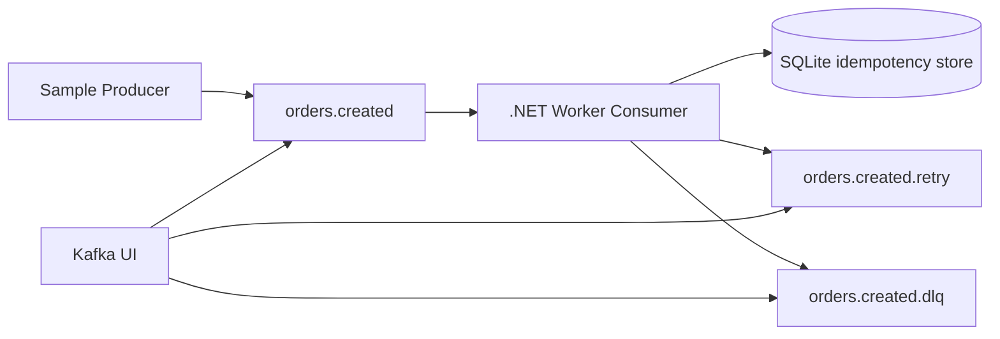

# Kafka Consumer Demo

Small .NET 10 sample showing a Kafka worker that processes before commit, retries transient failures by parking messages on a retry topic, sends poison/unexpected failures to a DLQ, and uses SQLite idempotency to tolerate redelivery.

## Architecture



## Requirements

- .NET 10 SDK
- Docker Desktop or another local Docker runtime

## Quickstart

```bash
docker compose -f docker/docker-compose.yml up -d
dotnet restore
dotnet run --project src/KafkaConsumerLab.Worker
```

In a second terminal:

```bash
dotnet run --project src/KafkaConsumerLab.Producer -- valid --count 5
```

Kafka UI is exposed at `http://localhost:8080`.

## Producer Examples

```bash
dotnet run --project src/KafkaConsumerLab.Producer -- valid --count 10
dotnet run --project src/KafkaConsumerLab.Producer -- transient --count 3
dotnet run --project src/KafkaConsumerLab.Producer -- poison --count 3
dotnet run --project src/KafkaConsumerLab.Producer -- duplicate --event-id fixed-123 --count 3
dotnet run --project src/KafkaConsumerLab.Producer -- mixed --count 20
```

## Native AOT Producer and Consumer

The `KafkaConsumerLab.AotProducer` and `KafkaConsumerLab.AotConsumer` projects are separate console applications intended for Native AOT publishing and later throughput benchmarking.

```bash
dotnet publish src/KafkaConsumerLab.AotProducer -c Release -r win-x64
dotnet publish src/KafkaConsumerLab.AotConsumer -c Release -r win-x64
```

Run the producer:

```bash
src/KafkaConsumerLab.AotProducer/bin/Release/net10.0/win-x64/publish/KafkaConsumerLab.AotProducer.exe --count 100000
```

Run the consumer with a fresh group:

```bash
src/KafkaConsumerLab.AotConsumer/bin/Release/net10.0/win-x64/publish/KafkaConsumerLab.AotConsumer.exe --group-id aot-bench-1 --count 100000
```

Benchmark the CoreCLR/JIT and Native AOT consumers against the same produced messages:

```bash
bash scripts/benchmark-consumers.sh --count 100000
```

On Windows PowerShell, use:

```powershell
.\scripts\benchmark-consumers.ps1 -Count 100000
```

See [docs/BENCHMARK.md](docs/BENCHMARK.md) for the benchmark quickstart and all options.

## Reliability Model

- Auto commit is disabled.
- The worker commits only after one durable outcome:
  - successful processing
  - duplicate detection
  - successful retry publish
  - successful DLQ publish
- If commit fails after processing, Kafka may redeliver and SQLite idempotency handles the duplicate.
- `MaxAttempts` is total processing attempts, including the first consume from `orders.created`.
- Retry is a parking topic in V1. The sample publishes `x-next-delay-ms` for observability, but no retry worker consumes it yet.

## Known Limitations

- The worker consumes only `orders.created`.
- `orders.created.retry` is not replayed automatically.
- SQLite is for local/demo idempotency only.
- The sample demonstrates at-least-once processing, not exactly-once semantics.

## Validation

```bash
dotnet restore
dotnet build --configuration Release
dotnet test --configuration Release
docker compose -f docker/docker-compose.yml config
```
